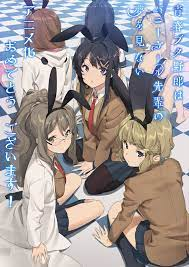

# app-dev
My first repository

##**My Favorite Series**

**1. Seishun Buta Yarou**
>*The rare and inexplicable Puberty Syndrome is thought of as a myth. It is a rare disease which only affects teenagers, and its symptoms are so supernatural that hardly anyone recognizes it as a legitimate occurrence. However, high school student Sakuta Azusagawa knows from personal experience that it is very much real, and happens to be quite prevalent in his school.*

**2. Scott Pilgrim: Takes Off**
>*Serves as an alternate retelling of the original Scott Pilgrim graphic novel series and movie. Like in the original series, Scott Pilgrim, a bassist in an indie band, falls in love with Ramona Flowers, a mysterious delivery girl, attracting the attention of Ramona's seven evil exes.*

**3. Yahari Ore No Seishun**
>*The pragmatic Hachiman Hikigaya and beautiful Yukino Yukinoshita, who despite their varying personalities and ideals, offers help and advice to others as part of their school's Service Club, assisted by the cheerful and friendly Yui Yuigahama.*

